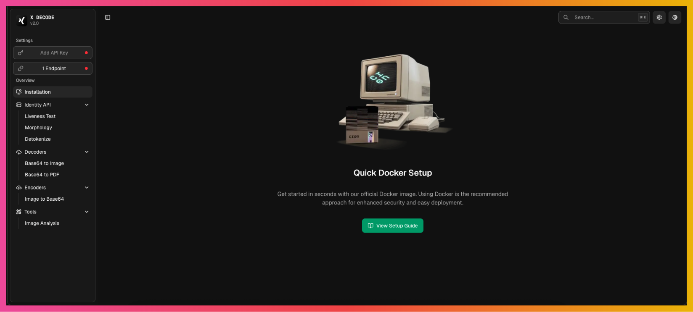

<div align="center">

<p></p>
</div>

<div align="center">
    <a href="#-getting-started">
        Getting Started
    </a>
    <span>&nbsp;✦&nbsp;</span>
    <a href="#-tools">
        Tools
    </a>
    <span>&nbsp;✦&nbsp;</span>
    <a href="#-features">
        Features
    </a>
    <span>&nbsp;✦&nbsp;</span>
    <a href="#%EF%B8%8F-stack">
        Stack
    </a>
    <span>&nbsp;✦&nbsp;</span>
    <a href="#%EF%B8%8F-contributing">
        Contributing
    </a>
</div>

</p>

<div align="center">


</div>

## 🔍 Overview

 Comprehensive web application for image analysis, document processing, and digital forensics tools. Built with modern web technologies, it provides powerful utilities for developers, security professionals, and digital analysts.

**Key capabilities:**
- 🖼️ Image encoding/decoding and analysis
- 📄 PDF processing and conversion
- 🔐 Document validation and liveness detection
- 🔧 Network utilities (MAC address tools)
- 📊 Analytics dashboard and reporting

## 🛠️ Tools

A comprehensive suite of digital analysis tools:

| Tool                    | Description                                                     |
| ----------------------- | --------------------------------------------------------------- |
| Image Decoder           | Decode base64 images and analyze metadata                      |
| Image Encoder           | Convert images to base64 format                                |
| PDF Decoder             | Extract and analyze PDF content from base64                    |
| Image Analysis          | Advanced image analysis with detailed reporting                |
| Liveness Detection      | Verify image authenticity and detect manipulation              |
| Document Validation     | Validate document integrity and authenticity                   |
| MAC Address Generator   | Generate random MAC addresses for testing                      |
| MAC Address Lookup      | Lookup vendor information from MAC addresses                   |

## ✨ Features

- **🔐 Authentication** - Secure user authentication with Clerk
- **🎨 Modern UI** - Beautiful interface built with Tailwind CSS and Shadcn-ui
- **📱 Responsive** - Fully responsive design for all devices
- **🌙 Dark Mode** - Built-in dark/light theme support
- **⚡ Fast** - Optimized performance with Next.js 15 and Turbopack
- **🔍 Search** - Global command palette with kbar
- **📊 Analytics** - Comprehensive dashboard with charts and metrics
- **🎯 TypeScript** - Full type safety throughout the application
- **♿ Accessible** - WCAG compliant components

## 🛠️ Stack

- [**Next.js 15**](https://nextjs.org/) - React framework with App Router and Turbopack
- [**TypeScript**](https://www.typescriptlang.org/) - JavaScript with syntax for types
- [**Tailwind CSS v4**](https://tailwindcss.com/) - Utility-first CSS framework
- [**Shadcn-ui**](https://ui.shadcn.com/) - Beautiful and accessible component library
- [**Clerk**](https://clerk.com/) - Complete authentication and user management
- [**React Hook Form**](https://react-hook-form.com/) + [**Zod**](https://zod.dev/) - Form handling with validation
- [**Zustand**](https://zustand-demo.pmnd.rs/) - State management for React
- [**Nuqs**](https://nuqs.47ng.com/) - Type-safe search params state manager
- [**Recharts**](https://recharts.org/) - Composable charting library for React
- [**Framer Motion**](https://www.framer.com/motion/) - Production-ready motion library
- [**kbar**](https://kbar.vercel.app/) - Command palette interface
- [**Sentry**](https://sentry.io/) - Error tracking and performance monitoring
- [**Lucide React**](https://lucide.dev/) - Beautiful and consistent icon library

## 🚀 Getting Started

> [!NOTE]  
> This project uses **Next.js 15** with **React 19** and **Tailwind CSS v4**

**Prerequisites:**
- [Node.js 18+ (recommended 20 LTS)](https://nodejs.org/en/)
- [pnpm](https://pnpm.io/) (recommended package manager)
- [Git](https://git-scm.com/)

**1. Clone the repository:**

```bash
git clone https://github.com/geo-mena/x-decode.git
cd x-decode
```

**2. Install dependencies:**

```bash
# Install pnpm globally if you don't have it
npm install -g pnpm

# Install project dependencies
pnpm install
```

**3. Environment setup:**

```bash
# Copy the environment template
cp env.example.txt .env.local

# Add your environment variables
# - Clerk authentication keys
# - Sentry DSN (optional)
# - API endpoints
```

**4. Start the development server:**

```bash
pnpm dev
```

The application will be available at [http://localhost:3000](http://localhost:3000)

### 🐳 Docker Deployment

For production deployment with Docker:

```bash
# Build the Docker image
chmod +x docker-build.sh
./docker-build.sh

# Or manually
docker build -t x-decode .
docker run -p 3000:3000 x-decode
```

> [!TIP]
> Check the `public/docs/docker-deployment.md` file for detailed Docker deployment instructions.

## ✌️ Contributing

Contributions are welcome! Please feel free to submit a Pull Request. For major changes, please open an issue first to discuss what you would like to change.

**Development workflow:**
1. Fork the repository
2. Create your feature branch (`git checkout -b feature/amazing-feature`)
3. Commit your changes (`git commit -m 'Add some amazing feature'`)
4. Push to the branch (`git push origin feature/amazing-feature`)
5. Open a Pull Request

## 🔑 License

This project is licensed under the [MIT License](LICENSE) - see the LICENSE file for details.
